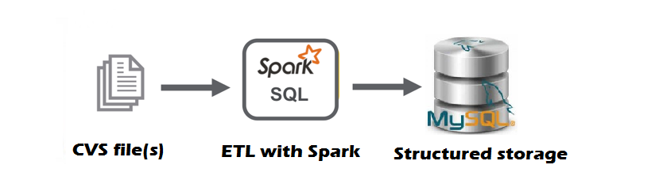

<h1 align="center">


<h3> <p align="center"> BR FEDERAL SERVERS GRATUITIES  </p> </h3>
<h3> <p align="center"> ================= </p> </h3>

>> <h3> Solution Architecture </h3>




>> <h3> Description </h3>

<p> In this project, we used SPARK (configured for an on-premises environment) to perform an ETL process of federal government employee gratuity data. The data is obtained through the government's Data Gov platform (totally free), and is organized by years, starting in 2012.
Every project is orchestrated by a shell script that installs a virtual environment, configures the machine and starts the project. </p>

>> <h3> How to Run </h3>

in your terminal (linux ou mac) run:

```
source start.sh

```
